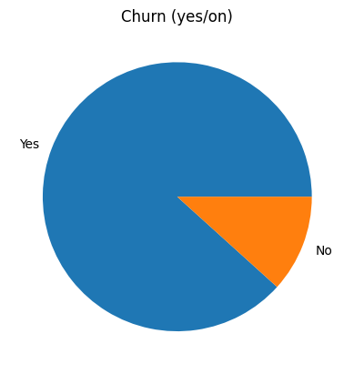
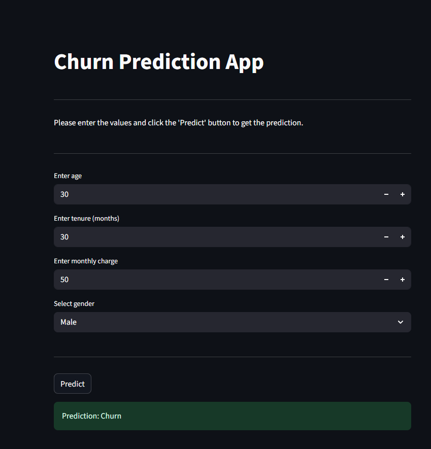

# Customer-Churn-Prediction

In this hands-on data science project, we build a complete customer churn prediction model from scratch using Python.


### The project covers:

🔍 Exploratory Data Analysis (EDA)

🛠 Feature Engineering

🤖 Machine Learning with scikit-learn

🚀 Deployment with Streamlit

Finally, we create an interactive Streamlit app to showcase the model and gain actionable insights into customer churn.

```

├── data/                # Dataset files
├── notebooks/           # Jupyter notebooks for EDA & experiments
├── churn_model.py       # Model training script
├── app.py               # Streamlit app
├── requirements.txt     # Project dependencies
└── README.md            # Project documentation
```


### Details of the dataset---
 [dataset](https://www.kaggle.com/datasets/abdullah0a/telecom-customer-churn-insights-for-analysis?resource=download)
 
 

### Final Product --
 
 
